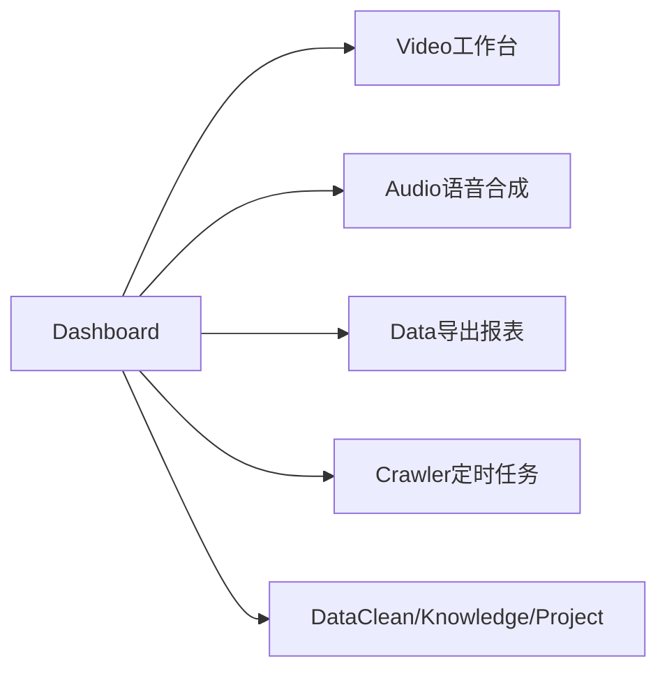

# 各模块新功能扩展计划（修订版 v2）

## 设计原则

- **延续现有模式**：Context + Mock 数据 + Ant Design 组件，不引入后端、不做真实音视频处理
- **新增子路由 3 处**：Video 工作台、Audio 语音合成、Crawler 定时任务
- **Data 不新增 Tab**：仅在现有 5 页加「导出报表」
- **Dashboard** 作为总入口：待办聚合 + 快捷操作深链

---

## 1. 工作台 Dashboard

**新增：待办聚合 + 插件快捷操作**

| 区块     | 内容                                                                                                      |
| -------- | --------------------------------------------------------------------------------------------------------- |
| 待办卡片 | 聚合 mock：待验收任务、待审核文档、舆情预警、运行中清洗批次；点击深链跳转                                 |
| 快捷操作 | 含「进入视频工作台」「语音合成」等，复用 [`src/config/capabilityLinks.ts`](src/config/capabilityLinks.ts) |

**改动文件**：[`src/pages/Dashboard/index.tsx`](src/pages/Dashboard/index.tsx)、[`src/mock/dashboard.ts`](src/mock/dashboard.ts)

---

## 2. 视频处理 Video

**新增：视频工作台（新 Tab + 新页面）**

- 路由 `/video/workspace`，SubNav 增加「视频工作台」（放在「能力概览」之后）
- **纯 UI 演示**，不做真实剪辑：

| 区域 | 内容                                                                                                 |
| ---- | ---------------------------------------------------------------------------------------------------- |
| 左侧 | 素材库：mock 视频列表 + 本地上传（复用 [`VideoUpload`](src/pages/Video/components/VideoUpload.tsx)） |
| 中部 | 预览播放器 + 时间码 / 总时长                                                                         |
| 底部 | 时间轴：视频轨 / 音频轨，片段块可选中，裁剪入点/出点标记（静态 mock）                                |
| 右侧 | 裁剪、分割、拼接、转码参数；「应用」仅 toast                                                         |
| 顶栏 | 撤销/重做（disabled）、保存草稿、导出（mock 进度条）                                                 |

- Overview「视频剪辑」深链 → `/video/workspace`

**改动文件**：新建 [`src/pages/Video/Workspace.tsx`](src/pages/Video/Workspace.tsx)、[`src/pages/Video/index.module.css`](src/pages/Video/index.module.css)、SubNav、router、[`src/mock/video.ts`](src/mock/video.ts)、capabilityLinks

---

## 3. 数据处理 Data

**新增：现有 5 页直接增加「导出报表」**

Dropdown（Excel / CSV / PDF）→ mock 延迟 + 下载 mock 文件：

| 页面                                                  | 导出内容            |
| ----------------------------------------------------- | ------------------- |
| [`Reports.tsx`](src/pages/Data/Reports.tsx)           | 报表列表            |
| [`AnalysisPage.tsx`](src/pages/Data/AnalysisPage.tsx) | 图表数据集          |
| [`Governance.tsx`](src/pages/Data/Governance.tsx)     | 治理任务列表        |
| [`Quality.tsx`](src/pages/Data/Quality.tsx)           | 质量评分与告警      |
| [`AiAnalysis.tsx`](src/pages/Data/AiAnalysis.tsx)     | 分析结论 + 图表摘要 |

- 公共工具 [`src/utils/exportReport.ts`](src/utils/exportReport.ts)

---

## 4. 音频交互 Audio

**新增：个性化语音合成（新 Tab + 新页面）**

- 路由 `/audio/synthesis`，SubNav 增加「语音合成」

| 模块     | 说明                                                             |
| -------- | ---------------------------------------------------------------- |
| 音色选择 | 标准女声 / 标准男声 / 商务女声 / 专属定制音色（10s 样本上传 UI） |
| 参数调节 | 语速 Slider（0.5x～2.0x）、音调 Slider（-12～+12）               |
| 场景模板 | 会议纪要生成 / 语音交互回复（预填 mock 话术）                    |
| 生成试听 | Progress → 波形占位 + 试听 / 下载 MP3（mock）                    |
| 历史记录 | 最近合成列表                                                     |

- Overview 场景卡片深链 → `/audio/synthesis?scenario=meeting`

**改动文件**：新建 [`src/pages/Audio/Synthesis.tsx`](src/pages/Audio/Synthesis.tsx)、SubNav、router、[`src/mock/audio.ts`](src/mock/audio.ts)、capabilityLinks

---

## 5. 搜索爬虫 Crawler

**新增：定时任务 Tab**

- 路由 `/crawler/schedules`，SubNav 增加「定时任务」
- 列表（名称、Cron、上次/下次执行）+ 启停 Switch + 「新建定时任务」Modal

**改动文件**：新建 [`src/pages/Crawler/Schedules.tsx`](src/pages/Crawler/Schedules.tsx)、SubNav、router、[`src/mock/crawler.ts`](src/mock/crawler.ts)

---

## 6. 数据清洗 DataClean

**新增 A：清洗前后对比 Drawer** — Quality 页，左右分栏原文 vs 清洗结果（mock）

**新增 B：流水线绑定批次** — Pipeline 页顶部批次 Select + 按层逐步执行动画

**改动文件**：[`Quality.tsx`](src/pages/DataClean/Quality.tsx)、[`Pipeline.tsx`](src/pages/DataClean/Pipeline.tsx)、[`src/mock/dataClean.ts`](src/mock/dataClean.ts)

---

## 7. 知识库 Knowledge

**新增 A：RAG 引用溯源** — Search 页回答下方来源卡片（知识库、文档、片段、置信度），可跳转详情

**新增 B：新建同步任务 Modal** — Sync 页

**改动文件**：[`SearchPage.tsx`](src/pages/Knowledge/SearchPage.tsx)、[`Sync.tsx`](src/pages/Knowledge/Sync.tsx)

---

## 8. 项目管理 Project

**新增 A：项目里程碑 Timeline** — Detail 概览 Tab

**新增 B：成员与角色 Table + 添加成员 Modal** — Detail 概览 Tab

**改动文件**：[`src/pages/Project/Detail.tsx`](src/pages/Project/Detail.tsx)、[`src/mock/project.ts`](src/mock/project.ts)

---

## 本次不做

| 模块 / 功能                   | 说明         |
| ----------------------------- | ------------ |
| Community 批量操作 / 推送历史 | 已从范围移除 |
| Task 看板拖拽 / 文档预览      | 已从范围移除 |
| Crawler 舆情趋势图            | 已从范围移除 |
| Knowledge 插件设置 Tab        | 已从范围移除 |
| Video 任务模板 / 报告导出     | 已取消       |
| Audio 说话人管理 / 历史回填   | 已取消       |
| Data 报表向导 / 同步日志      | 已取消       |
| 真实 API / 持久化             | 不在范围     |

---

## 实施顺序

1. **路由骨架**：Video Workspace、Audio Synthesis、Crawler Schedules（SubNav + router + breadcrumb）
2. **三个重点页**：视频工作台 UI → 语音合成页 → Data 五页导出 + `exportReport.ts`
3. **Dashboard**：待办 + 快捷操作，更新 capabilityLinks
4. **其余模块**：Crawler Schedules 内容、DataClean、Knowledge、Project
5. **收尾**：`npm run build`、GitHub Pages 验证

---

## 预期结果

- **8 个模块**各有可见新能力（Dashboard + Video + Data + Audio + Crawler + DataClean + Knowledge + Project）
- **Video / Audio** 各有一个独立新 Tab 页面可完整演示
- **Data** 五个 Tab 均可导出报表
- 纯前端 Mock，部署流程不变
