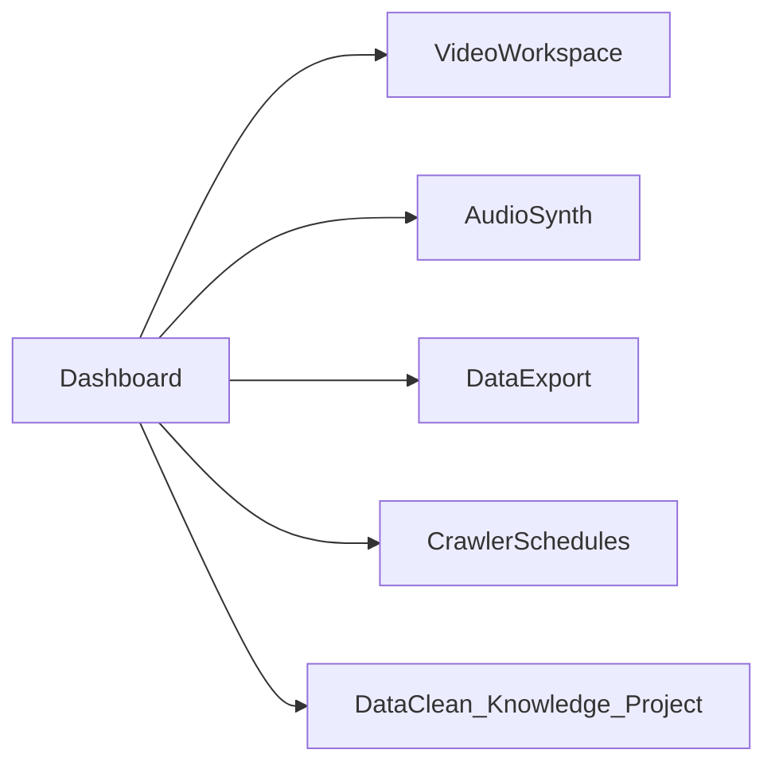

# 各模块新功能扩展 — 执行计划

你已确认 v2 计划并说 **go**。当前环境仍在 **Plan 模式**，代码写入被拦截；确认本计划后请切换到 **Agent 模式** 开始实施。

## 架构原则

- 延续 **Context + Mock + Ant Design**，不引入后端
- 新增子路由 3 处：`/video/workspace`、`/audio/synthesis`、`/crawler/schedules`
- Data 不新增 Tab，仅在现有 5 页加「导出报表」
- Dashboard 作为总入口：待办聚合 + 快捷操作深链



---

## 阶段 1：路由骨架

**文件**：[router/index.tsx](src/router/index.tsx)、各 SubNav、 [MainLayout/index.tsx](src/layouts/MainLayout/index.tsx)

| 模块    | 路由                 | SubNav 项              | breadcrumb                            |
| ------- | -------------------- | ---------------------- | ------------------------------------- |
| Video   | `/video/workspace`   | 视频工作台（概览之后） | `workspace` + root=video → 视频工作台 |
| Audio   | `/audio/synthesis`   | 语音合成               | synthesis → 语音合成                  |
| Crawler | `/crawler/schedules` | 定时任务               | schedules → 定时任务                  |

---

## 阶段 2：三个重点新页面

### Video 工作台 — [Workspace.tsx](src/pages/Video/Workspace.tsx)

- 左：素材库 mock + [VideoUpload](src/pages/Video/components/VideoUpload.tsx)
- 中：预览 + 时间码；底：视频轨/音频轨时间轴（可选中片段、入出点标记）
- 右：裁剪/分割/拼接 + 转码参数；顶栏撤销/重做(disabled)/保存/导出(mock 进度)
- Mock 数据扩展：[mock/video.ts](src/mock/video.ts) 增加 `workspaceAssets`、`workspaceTimelineClips`
- 样式：[Video/index.module.css](src/pages/Video/index.module.css)

### Audio 语音合成 — [Synthesis.tsx](src/pages/Audio/Synthesis.tsx)

- 音色选择、语速/音调 Slider、场景模板（会议纪要/语音回复）
- 生成试听 Progress + 波形占位 + 历史列表
- Mock：[mock/audio.ts](src/mock/audio.ts)
- 深链：`/audio/synthesis?scenario=meeting`

### Data 导出报表

- 公共工具：[utils/exportReport.ts](src/utils/exportReport.ts)（csv/json/pdf mock 下载）
- 公共组件：[components/ExportReportButton/index.tsx](src/components/ExportReportButton/index.tsx)
- 接入 5 页：[Reports.tsx](src/pages/Data/Reports.tsx)、[AnalysisPage.tsx](src/pages/Data/AnalysisPage.tsx)、[Governance.tsx](src/pages/Data/Governance.tsx)、[Quality.tsx](src/pages/Data/Quality.tsx)、[AiAnalysis.tsx](src/pages/Data/AiAnalysis.tsx)

---

## 阶段 3：Dashboard + capabilityLinks

**Dashboard**：[Dashboard/index.tsx](src/pages/Dashboard/index.tsx)、[mock/dashboard.ts](src/mock/dashboard.ts)

- 待办卡片：待验收任务、待审核文档、舆情预警、运行中清洗批次 → 深链跳转
- 快捷操作：含「视频工作台」「语音合成」等

**capabilityLinks**：[config/capabilityLinks.ts](src/config/capabilityLinks.ts)

```typescript
// 待改
'视频剪辑': { path: '/video/workspace' }
'会议纪要': { path: '/audio/synthesis', params: { scenario: 'meeting' } }
// 等场景卡片同步
```

---

## 阶段 4：其余模块

| 模块      | 功能                                                         | 主要文件                                                                                                                                                         |
| --------- | ------------------------------------------------------------ | ---------------------------------------------------------------------------------------------------------------------------------------------------------------- |
| Crawler   | 定时任务列表 + 新建 Modal + 启停                             | [Schedules.tsx](src/pages/Crawler/Schedules.tsx)、[mock/crawler.ts](src/mock/crawler.ts)                                                                         |
| DataClean | Quality 清洗对比 Drawer；Pipeline 批次 Select + 逐步执行动画 | [Quality.tsx](src/pages/DataClean/Quality.tsx)、[Pipeline.tsx](src/pages/DataClean/Pipeline.tsx)                                                                 |
| Knowledge | Search RAG 引用溯源卡片；Sync 新建任务 Modal + `addSyncTask` | [SearchPage.tsx](src/pages/Knowledge/SearchPage.tsx)、[Sync.tsx](src/pages/Knowledge/Sync.tsx)、[KnowledgeContext.tsx](src/pages/Knowledge/KnowledgeContext.tsx) |
| Project   | Detail 里程碑 Timeline + 成员 Table/Modal                    | [Detail.tsx](src/pages/Project/Detail.tsx)、[mock/project.ts](src/mock/project.ts)                                                                               |

---

## 明确不做

Community / Task 扩展、Crawler 舆情图、Knowledge Settings Tab、Video 任务模板/报告导出、Audio 说话人/历史回填、Data 报表向导/同步日志、真实 API

---

## 收尾

1. `npm run build` 验证无 TS/路由错误
2. 抽查深链：Overview 卡片 → 新页面
3. （可选）push 触发 GitHub Pages 部署
